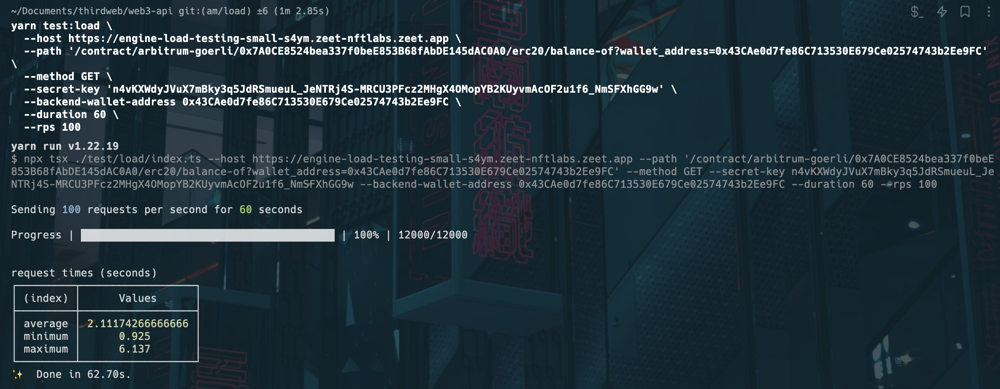

## How to load test engine

This repository comes with a built-in load testing tool to measure load and processing times for different engine endpoints.

You can use the tool with the `yarn test:load` command.

The following arguments are supported:

| Argument                 | Required | Description                                                   |
| ------------------------ | -------- | ------------------------------------------------------------- |
| `host`                   | ✅       | The engine API host url                                       |
| `path`                   | ✅       | The path of the endpoint to load test                         |
| `method`                 | ✅       | The request method to use                                     |
| `body`                   | ❌       | The JSON string of the request body to use                    |
| `secret-key`             | ✅       | The thirdweb API secret key to use to authorize your requests |
| `backend-wallet-address` | ✅       | The x-backend-wallet-address header value                     |
| `account-address`        | ❌       | The x-account-address header value                            |
| `rps`                    | ❌       | The number of requests per second to send. Defaults to 30     |
| `duration`               | ❌       | The number of seconds to send requests for. Defaults to 1     |

If you don't specify some of the required parameters, the command will prompt you to provide values for them before sending requests.

You can use this tool to load test both read and write endpoints.

For example, here is a command using this tool to load test a read endpoint for 1 minute:

```
npx tsx ./test/load/index.ts \
  --host http://127.0.0.1:3005 \
  --path '/contract/arbitrum-goerli/0x7A0CE8524bea337f0beE853B68fAbDE145dAC0A0/erc20/balance-of?wallet_address=0x43CAe0d7fe86C713530E679Ce02574743b2Ee9FC' \
  --method GET \
  --secret-key 'n4vKXWdyJVuX7mBky3q5JdRSmueuL_JeNTRj4S-MRCU3PFcz2MHgX4OMopYB2KUyvmAcOF2u1f6_NmSFXhGG9w' \
  --backend-wallet-address 0x43CAe0d7fe86C713530E679Ce02574743b2Ee9FC \
  --duration 60 \
  --rps 100
```

And here are the results:



And here's a command using the tool to send a batch of 30 transactions all at once:

```
npx tsx ./test/load/index.ts \
  --host http://127.0.0.1:3005 \
  --path /contract/arbitrum-goerli/0x7A0CE8524bea337f0beE853B68fAbDE145dAC0A0/erc20/mint-to \
  --method POST \
  --body '{ "to_address": "0x43CAe0d7fe86C713530E679Ce02574743b2Ee9FC", "amount": "1.0" }' \
  --secret-key 'n4vKXWdyJVuX7mBky3q5JdRSmueuL_JeNTRj4S-MRCU3PFcz2MHgX4OMopYB2KUyvmAcOF2u1f6_NmSFXhGG9w' \
  --backend-wallet-address 0x43CAe0d7fe86C713530E679Ce02574743b2Ee9FC
```

And here are the results:


